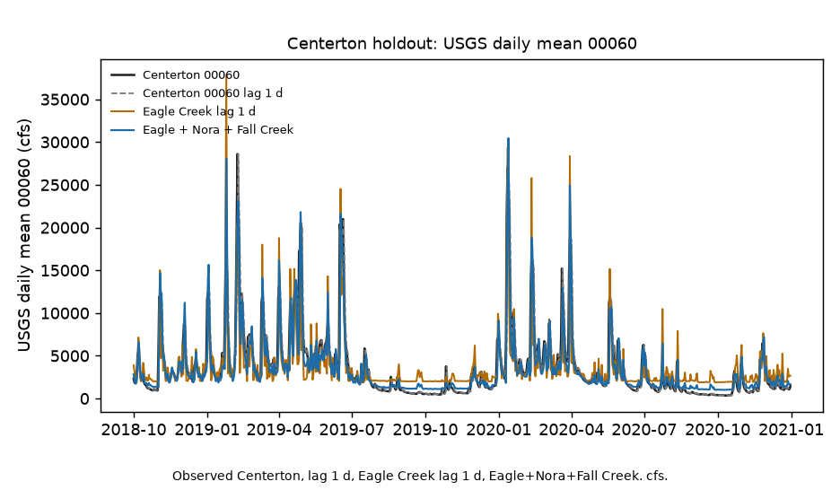
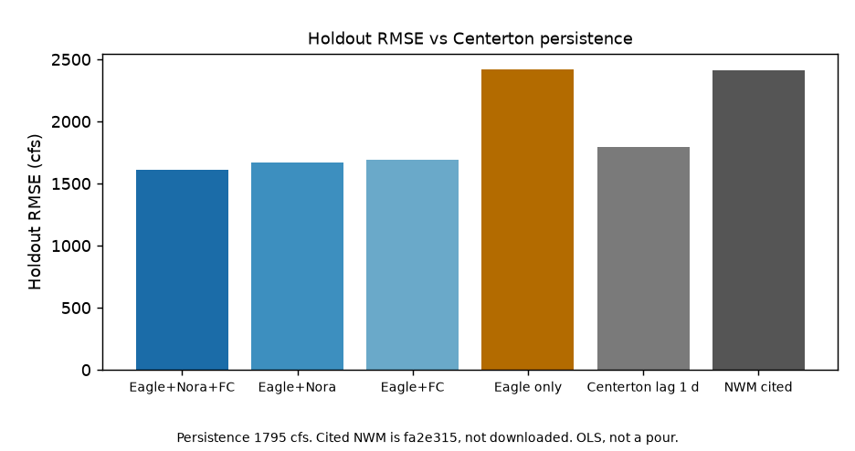

# White River Eagle Creek vs Centerton persistence

Does adding Eagle Creek help you guess tomorrow's flow at Centerton?

Most days, no. Yesterday at Centerton is still closer (MAE 810 cfs vs 823 to 938 if you add tributaries). On the big days, yes: Nora + Fall Creek + Eagle Creek drops RMSE from 1,795 to 1,607. Eagle Creek by itself is worse than doing nothing (2,421). The official model we compared to (NWM at Centerton, 2,414 from `fa2e315`) is in that same last place.

So this is not "we found the missing tributary." It is "extra gages help the peaks; they do not beat yesterday on a normal day."

Science lock: `ea1c0e1`. Same years as the other White River discharge tests. No 2026. This tree does not read `p_sfha`. Not a flood-inundation map.

## What we ran

Train through 30 Sep 2018, test 1 Oct 2018 to 31 Dec 2020. All daily USGS discharge (00060), cubic feet per second.

- Target: White River near Centerton (03354000)
- Inputs, all yesterday: Eagle Creek at Indianapolis (03353500), White River near Nora (03351000), Fall Creek at Millersville (03352500)

We did not use White River at Indianapolis as an input. We did not use flood maps.

Site **03353500** Eagle Creek at Indianapolis, IN is the complete daily 00060 on this window. **03353240** (79th Street) is empty: stop, same as Fall Creek 16th Street. **03353451** (below reservoir) starts 2016-10-26: stop. No alternate.



Figure 1. Centerton 00060, Centerton lag 1 d, Eagle Creek lag 1 d, Eagle plus Nora plus Fall Creek. Eagle-only overshoots. Weight 7.10 is OLS, not a pour.



Figure 2. Holdout RMSE. Mixes sit below Centerton lag 1 d. Eagle-only sits with cited NWM at the back.

## Numbers (test period)

| Guess from yesterday | RMSE | MAE | Better than Centerton yesterday? |
|--------------------|-----:|----:|--------------------------------|
| Eagle + Nora + Fall Creek | 1,607 | 823 | RMSE only |
| Eagle + Nora | 1,668 | 872 | RMSE only |
| Eagle + Fall Creek | 1,694 | 938 | RMSE only |
| Centerton itself | 1,795 | 810 | bar |
| NWM at Centerton (from the NWM-error repo, not downloaded again) | 2,414 | n/a | no |
| Eagle Creek alone | 2,421 | 1,558 | no |

Eagle-only uses one scale factor (7.10). That is not "Eagle Creek is the White River."

## Next to Fall Creek at Indy

There, Nora + Fall Creek beat lag 1 d at Indianapolis on the headline number (1,265 vs 1,450, `962d503`). Here the headline has to be: RMSE and MAE do not agree. The three-feature RMSE 1,607 matches `8e4fdca` (that tree asked versus Nora-plus-Fall-Creek 1,734 and is not restamped).

White Lick is still untested. This repo stops.

## Sister notes

- Fall Creek gap: https://github.com/martialsystems/white_river_fall_creek_gap
- NWM error: https://github.com/martialsystems/white_river_nwm_error
- Hydrology gist: https://gist.github.com/martialsystems/1104e5e47b8a04006ec694d289d43639

Not a flood-inundation map.

## Stage 0

```bash
python3.12 -m venv .venv
source .venv/bin/activate
pip install -r requirements.txt
PYTHONPATH=src:. python3 scripts/run_fixture.py logs/stage0_fixture
.venv/bin/python -m pytest tests -q
PYTHONPATH=src:. python3 scripts/run_live.py logs/nora_live
```

Two figures max. Empty or late Eagle Creek 00060 stops (`run_live.py` exit 2).

Research index: https://gist.github.com/martialsystems/66b896b0a4a0b8cba2b478aef64312f3
